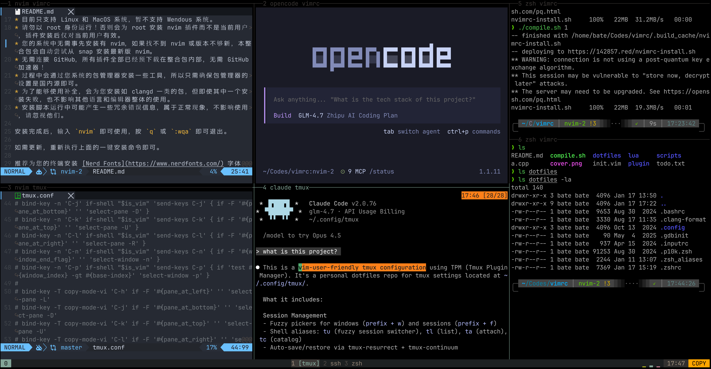

# 小彭老师自用 Tmux 配置

这是一个为 Vim 键位习惯优化的 Tmux 配置，使用 [Tmux Plugin Manager](https://github.com/tmux-plugins/tpm) 管理插件，提供模糊选择器、美观的 Gruvbox 状态栏和智能会话管理。



## 一键快捷安装

```bash
git clone https://github.com/archibate/tmux-conf ~/.config/tmux --depth=1 && ~/.config/tmux/scripts/tmux_install.sh
```

推荐搭配小彭老师的 [NeoVim 配置](https://github.com/archibate/vimrc) 一起使用。

<!-- 详情请看小彭老师的介绍视频：[BV](https://bilibili.com/BV) -->

## 功能特性

- **最小冲突的前缀键** - `C-z` 作为前缀键（可改），最小化与 Vim 和 Bash 的键位冲突
- **Vim 风格快捷键** - 使用 `C-h`/`C-j`/`C-k`/`C-l` 导航窗格，`M-h`/`M-j`/`M-k`/`M-l` 调整大小
- **模糊选择器** - 基于 fzf 的会话、窗口和目录浏览器，支持实时预览（前缀键 + f/w）
- **美观状态栏** - Gruvbox 配色方案，显示 CPU、内存和 API 使用量
- **会话持久化** - 通过 tmux-continuum 每 15 分钟自动保存
- **智能剪贴板** - tmux-yank 无缝集成系统剪贴板，与 Vim 剪贴板同步
- **统计弹窗** - 实时系统指标，柱状图显示内存和 CPU 用量历史记录（前缀键 + i）
- **问题监控** - 后台检测所有窗格中的新问题（可选）

## 安装

```bash
# 1. 安装依赖
sudo apt install tmux fzf xsel tree python3   # Debian/Ubuntu
brew install tmux fzf tree python3            # macOS

# 2. 克隆此仓库
git clone https://github.com/archibate/tmux-conf ~/.config/tmux

# 3. 运行安装脚本（设置配置、别名、TPM 和插件）
bash ~/.config/tmux/scripts/tmux_install.sh

# 4. 启动 tmux
tmux start-server

# 5. 新建一个会话
tmux new -s example_session
```

就这样！安装脚本会自动设置：
- `~/.tmux.conf` 配置文件的符号链接
- Shell 别名（`tu`、`tl`、`ta`、`ts`、`tb`）
- TPM（Tmux 插件管理器）和所有插件

## 为什么选择 Tmux

### 理解 Tmux 的价值

SSH 用户为什么热爱 Tmux？主要因为它能解决远程会话管理的核心痛点：

**1. 会话持久化 - 连接断开不影响工作**
SSH 连接不稳定是常态。网络波动、电脑休眠、服务器重启都可能导致连接中断。使用 Tmux 时，即使 SSH 连接断开，所有正在运行的程序（编译、训练、服务）都会继续执行。只需重新登录并运行 `tmux attach` 即可回到之前的工作状态，就像从未离开过一样。

**2. 同时管理多个任务 - 一个窗口搞定所有**
SSH 没有图形界面，通常需要打开多个 SSH 终端窗口来同时运行多个任务。使用 Tmux，你可以在一个终端窗口内创建多个窗格和窗口，实时监控编译输出、日志文件、服务状态等，无需在多个 SSH 窗口间来回切换。

**3. 保存工作环境 - 随时恢复**
Tmux 可以保存你的整个工作环境：多个窗格、每个窗格运行的不同程序、目录位置等。下次登录时一键恢复所有状态，省去每次重新配置的时间。

**4. 高效复制 - 超越终端限制**
普通终端难以复制多行文本（特别是跨行的日志输出）。Tmux 的复制模式可以让你像在 Vim 里一样自由移动光标，选中任意范围的文本，甚至使用正则搜索快速定位内容，然后一键复制到系统剪贴板，或粘贴命令到 Bash 中执行。

**5. 内容同步 - 多端共享**

同一个 Tmux 会话可以被多个终端窗口同时访问，远程协作时你和队友可以同步看到相同的界面输出。从电脑到手机，无缝切换共享相同进程无需重启，只需 attach 到同一个会话，重现之前运行中的所有工作。

即使您不是 SSH 用户，Tmux 也是必须的：

- 您是否常常在 Vim 中打开终端，一边编辑文件一边运行多个后台任务，但无法打开太多个，会让 Vim 显示不下。
- 一旦在 Vim 终端中启动了命令（如训练大模型），就不敢关掉 Vim，如果 Vim 需要重载或奔溃，命令也会一起被杀死。
- 您常常不得不利用终端模拟器自身的 Ctrl+Shift+T 新建大量窗口，且窗口各自独立，无法并排显示，也无法移动和合并。
- 不同窗口间 Vim 剪切板不共享，复制粘贴时需要鼠标滚轮，点选，Ctrl+Shift+V 等繁琐非标准键位。

总之，终端模拟器（或 IDE 内置终端）自身的多窗口使用极其不便，Vim 的“窗口”也无法替代 Tmux。

最重要的是，如果你是 **Vibe Coding**（通过自然语言指挥 AI 工具写代码）的重度用户，肯定常常多开 Claude Code 这类基于命令行的 Agent 工具，同时并行多个对话流。那么 Tmux 的多开可以帮你成为一名高效的“包工头”。

### Tmux 的层级结构

**会话（Session）** => **窗口（Window）** => **窗格（Pane）**

这个三层结构让 Tmux 能够高效组织多个终端任务：

1. **会话（Session）** - 最高层级，表示一个独立的工作环境
   - 一个 tmux 服务器可以同时运行多个会话
   - 每个会话可以独立管理，例如 `work`、`personal`、`dev` 等
   - 即使退出 SSH 连接，会话仍然在后台运行
   - 使用 `tmux ls` 查看所有会话，`tmux attach -t <name>` 重新连接
   - 使用 `tmux kill-session` 可以强制杀死会话

2. **窗口（Window）** - 会话的下一级，类似浏览器的标签页
   - 每个会话包含多个窗口，窗口间互相独立
   - 可以给窗口命名，如 `editor`、`server`、`logs` 等
   - 使用快捷键切换窗口（如 `前缀 + n/p` 或 `前缀 + 1-9`）
   - 类似多个独立的终端窗口，但在同一个会话中管理

3. **窗格（Pane）** - 窗口内的分割区域，类似 Vim 的 split
   - 一个窗口可以水平或垂直分割成多个窗格
   - 所有窗格在同一个窗口内显示，可以并排查看多个任务
   - 使用 `h/j/k/l` 在窗格间快速切换
   - 可以调整窗格大小（`H/J/K/L`）或重新排列
   - 窗格中的 Shell 退出（`exit` 或 `C-d`）时窗格自动关闭

**层级关系可视化：**
```
tmux server
├── Session: work
│   ├── Window: editor (1)
│   │   ├── Pane: vim (left)
│   │   └── Pane: tests (right)
│   ├── Window: server (2)
│   │   └── Pane: npm run dev
│   └── Window: logs (3)
│       └── Pane: tail -f log.txt
├── Session: personal
│   ├── Window: chat
│   └── Window: music
└── Session: dev
    └── Window: code
```

这种结构让你可以：
- 用会话隔离不同的工作场景（工作、个人、学习等）
- 用窗口组织相关的任务（编辑器、服务器、日志等）
- 用窗格实时监控多个输出（代码、测试、日志等）

> 太喜欢 Tmux 的窗格系统了？还可以了解一下 i3 / awesome 这类平铺型桌面管理器（替代传统的 GNOME / KDE / Xfce4）。

### 理解 Tmux 的三大模式

Tmux 有三种主要工作模式，如果你熟悉 Vim，这些模式会非常直观：

| 模式 | Vim 类比 | 说明 |
|------|----------|------|
| **TMUX** | 插入模式 | 终端正常工作模式，可以直接向终端输入命令 |
| **WAIT** | Ctrl-w 组合键 | 前缀键 `C-z` 按下后的等待状态，准备接收窗格操作快捷键（如 `C-z d` 表示分离会话） |
| **COPY** | 普通模式 | 复制模式，可以用 `h/j/k/l` 自由移动光标浏览历史输出，不受终端限制，也支持类似 Vim 的 `w/e/^/$` 等键位 |
| **VISUAL** | 可视模式 | 复制模式的一个子模式，在复制模式下按 `v` 进入，可以自由移动光标选中文本后，按 `y` 复制 |
| **EX** | EX 模式 | 按下前缀键 `C-z` 后，再按 `:`，可进入任意命令的输入，例如 `:detach` 等价于运行了 `tmux detach` |
| **SYNC** | 多光标模式 | 可在多个终端同步输入相同命令，不常用 |

#### 模式切换方式

```
┌──────────────────────────────────────────────────────────────┐
│                                                              │
│   TMUX 模式 (终端模式) ──→ 按键直接显示在终端中              │
│   ↓ 按 Ctrl-z (前缀键)                                       │
│   WAIT 模式 (等待命令) ─┬→ 按 h/j/k/l/x/c/n/p 等执行窗格操作 │
│                         ├→ 按 : 进入 EX 命令模式             │
│                         ├→ 按 d 分离会话（离开 Tmux）        │
│                         ├→ 按 P 粘贴当前剪切板内容           │
│   ↓ 按 Esc                                                   │
│   COPY 模式 (复制模式) ──→ 按 h/j/k/l/w/e/^/$ 自由移动光标   │
│                          ↓ 按 / 搜索（支持正则表达式）       │
│                          ↓ 按 v 进入 VISUAL 选择             │
│                          ↓ 按 y 复制 → 按 p 粘贴             │
│                          ↓ 按 i/a/q/Esc                      │
│                          回到 TMUX 模式                      │
│                                                              │
└──────────────────────────────────────────────────────────────┘
```

#### 各模式详解

**TMUX 模式**（终端模式）
- 这是默认模式，终端像正常 shell 一样工作
- 可以直接输入命令、运行程序
- 类似 Vim 的插入模式，你"插入"内容到终端

**WAIT 模式**（等待命令）
- 按 `Ctrl-z`（前缀键）进入
- 状态栏右下角会显示绿色的 `WAIT`
- 此时输入 `h` 会切换到左侧窗格，而不是在终端输入字母 `h`
- 如果几秒内不输入任何命令，自动回到 TMUX 模式
- 类似 Vim 中按 `Ctrl-w` 后等待下一个键的状态

**COPY 模式**（复制模式）
- 按 `前缀 + Esc` 进入
- 可以用 `h/j/k/l` 自由移动光标，浏览历史输出
- 不再被限制在终端的最后一行
- 按 `v` 进入 VISUAL 选择模式，用 `h/j/k/l` 选择文本
- 按 `y` 复制选中内容
- 按 `i`、`a`、`q` 或 `Esc` 退出，回到 TMUX 模式
- 类似 Vim 的普通模式，你可以"导航"和"操作"

#### 状态指示器

本配置提供的 **tmux-mode-indicator** 会在右下角的实时显示当前模式：

| 显示 | 模式 | 颜色 |
|------|------|------|
| `TMUX` | 终端模式 | 青色 |
| `WAIT` | 等待命令 | 绿色 |
| `COPY` | 复制模式 | 橙色 |
| `SYNC` | 同步模式 | 红色 |

这些设计让 Vim 用户感到非常自然：就像在 Vim 中按 `Esc` 回到普通模式，按 `i/a` 回到插入模式输入一样，而状态栏会提示当前模式。

## 本配置提供的 Tmux 快捷键

### 前缀键

前缀键是 `Ctrl-z`（替代 tmux 内置默认的 `Ctrl-b`，更符合人体工学）。

你可以在 [tmux.conf](tmux.conf) 中自定义前缀键：

```tmux
unbind C-b
set -g prefix C-z
bind C-z send-prefix
```

### 窗格导航

| 快捷键 | 功能 |
|--------|------|
| `前缀 + h` | 移动到左侧窗格 |
| `前缀 + j` | 移动到下方窗格 |
| `前缀 + k` | 移动到上方窗格 |
| `前缀 + l` | 移动到右侧窗格 |
| `前缀 + ;` | 上一个窗格（快速切换） |
| `前缀 + x` | 关闭当前窗格 |
| `前缀 + b` | 将窗格分离到新窗口 |
| `前缀 + m` | 将窗格移动到另一个窗口 |

### 窗格管理

| 快捷键 | 功能 |
|--------|------|
| `前缀 + H` | 将窗格向左移动 |
| `前缀 + J` | 将窗格向下移动 |
| `前缀 + K` | 将窗格向上移动 |
| `前缀 + L` | 将窗格向右移动 |
| `前缀 + s` | 水平分割（类似 vim 的 `:split`） |
| `前缀 + v` | 垂直分割（类似 vim 的 `:vsplit`） |
| `前缀 + C-o` | 旋转窗格 |

### 窗口管理

| 快捷键 | 功能 |
|--------|------|
| `前缀 + c` 或 `t` | 创建新窗口 |
| `前缀 + 1-9` | 选择窗口 1-9 |
| `前缀 + n` | 下一个窗口 |
| `前缀 + p` | 上一个窗口 |
| `前缀 + a` | 上一个窗口（快速切换） |
| `前缀 + ,` | 重命名窗口 |
| `前缀 + X` | 关闭窗口 |
| `前缀 + w` | 窗口选择器 (fzf) |
| `前缀 + M-n` | 将当前窗口向后移动 |
| `前缀 + M-p` | 将当前窗口向前移动 |

### 会话管理

| 快捷键 | 功能 |
|--------|------|
| `前缀 + f` | 会话选择器 (fzf) |
| `前缀 + F` | 目录选择器（所有会话/窗口） |
| `前缀 + A` | 上一个会话（快速切换） |
| `前缀 + .` | 重命名会话 |
| `前缀 + d` | 分离会话 |

### 复制模式（Vi 风格）

| 快捷键 | 功能 |
|--------|------|
| `前缀 + Esc` | 进入复制模式 |
| `v` | 开始视觉选择 |
| `V` | 选择整行 |
| `Ctrl-v` | 矩形选择切换 |
| `y` | 复制选择 |
| `Y` | 复制到系统剪贴板（通过 xclip） |
| `p` | 从 tmux 缓冲区粘贴 |
| `i`/`a`/`q`/`Esc` | 退出复制模式 |

### 插件管理

| 快捷键 | 功能 |
|--------|------|
| `前缀 + I` | 安装插件 |
| `前缀 + U` | 更新插件 |
| `前缀 + R` | 重新加载 `~/.tmux.conf` |

### 其他

| 快捷键 | 功能 |
|--------|------|
| `前缀 + ?` | 列出所有快捷键 |
| `前缀 + Ctrl-w` | 保存窗格到文件 (`/tmp/tmux-capture-YYYYMMDD-HHMMSS.txt`) |
| `前缀 + P` | 粘贴缓冲区 |

## 插件快捷键

### tmux-yank（剪贴板）

| 快捷键 | 功能 |
|--------|------|
| `前缀 + y` | 复制命令行到剪贴板 |
| `前缀 + Y` | 复制当前目录到剪贴板 |
| `y`（复制模式中） | 复制选择到系统剪贴板 |
| `Y`（复制模式中） | 复制并粘贴到命令行 |

**鼠标**：用鼠标选择文本可直接复制到剪贴板（类似 Wendous Terminal）。

### tmux-sidebar（目录树）

| 快捷键 | 功能 |
|--------|------|
| `前缀 + Tab` | 切换侧边栏（树形视图） |
| `前缀 + Backspace` | 切换侧边栏并聚焦 |

### tmux-copycat（搜索）

| 快捷键 | 功能 |
|--------|------|
| `前缀 + /` | 正则表达式搜索 |
| `前缀 + Ctrl-f` | 搜索文件 |
| `前缀 + Ctrl-g` | 搜索 git 哈希值（`git log` 后） |
| `前缀 + Ctrl-u` | 搜索 URL |
| `前缀 + Ctrl-d` | 搜索数字 |
| `前缀 + Alt-h` | 搜索 SHA 哈希值 |
| `前缀 + Alt-i` | 搜索 IP 地址 |

在 copycat 模式中：
- `n` - 下一个匹配
- `N` - 上一个匹配
- `Enter` - 复制匹配（vi 模式）

### tmux-open（打开文件/URL）

> **注意**：以下快捷键需要先进入复制模式（`前缀 + Esc`）

复制模式中：
| 快捷键 | 功能 |
|--------|------|
| `o` | 用系统默认程序打开当前光标位置的文件/链接 |
| `Ctrl-o` | 用 `$EDITOR` 打开 |
| `Shift-s` | 在网络浏览器中搜索 |

**使用方法**：
1. 按 `前缀 + Esc` 进入复制模式
2. 移动光标到文件路径或 URL 上，按 `o` 直接打开
3. 或先用 `v` 选中文本，再按 `o` 打开选中的内容

### tmux-which-key（操作菜单）

| 快捷键 | 功能 |
|--------|------|
| `前缀 + Space` | 显示操作菜单 |
| `Ctrl-Space` | 显示操作菜单（根表） |

### tmux-resurrect（会话持久化）

| 快捷键 | 功能 |
|--------|------|
| `前缀 + Ctrl-s` | 手动保存会话 |
| `前缀 + Ctrl-r` | 恢复已保存的会话 |

**注意**：tmux-continuum 每 15 分钟自动保存，tmux 启动时自动恢复。

## 常用的 Tmux 默认快捷键（未被覆盖）

| 快捷键 | 功能 |
|--------|------|
| `前缀 + :` | 命令提示符 |
| `前缀 + [` | 进入滚动模式（Esc 的替代方式） |
| `前缀 + ]` | 从缓冲区粘贴 |
| `前缀 + space` | 下一个布局 |
| `前缀 + z` | 放大/缩小窗格 |
| `前缀 + {` | 与左侧窗格交换 |
| `前缀 + }` | 与右侧窗格交换 |
| `前缀 + o` | 向前旋转窗格 |
| `前缀 + ~` | 显示消息 |

## Shell 别名

在引入 [`~/.config/tmux/scripts/tmux_aliases.sh`](scripts/tmux_aliases.sh) 后：

| 命令 | 功能 |
|---------|--------|
| `tu` | 显示 fzf 会话选择器 |
| `tu <name>` | 附加到或创建会话 `<name>` |
| `tu .` | 创建/使用以当前目录命名的会话 |
| `tl` | 列出会话 (`tmux ls`) |
| `ta` | 附加到会话 (`tmux attach`) |
| `tv` | 查看当前窗格历史输出（`less` 分页器） |
| `ts` | 完整 Claude 分析，带关注表格 |
| `tb` | 快速关注视图（🔴🟡🟢） |

## 状态栏

状态栏显示（从左到右）：
- 会话名称（蓝色）
- 主机名
- 当前路径
- CPU 使用率（绿色）
- 内存使用率（绿色）
- GLM API 使用率（紫色）
- 当前时间
- Tmux 模式指示器

### Claude Code 状态指示器

使用 Claude Code 时，当 Claude 正在思考时，窗口列表中会显示 `✻`。这由 `claude_status.sh` 后台监控器处理。

### 统计弹窗（`前缀 + i`）

显示实时系统指标，带 20 点 sparkline 历史记录：

| 指标 | 描述 |
|--------|------|
| **LOAD** | 1/5/15 分钟负载平均值（按 CPU 核心数缩放） |
| **CPU** | 当前使用率百分比及平均值 |
| **MEM** | 内存使用率百分比及平均值 |
| **GLM** | Claude API 令牌使用率（固定 0-100 刻度） |

使用 Gruvbox 配色：🔴 高 > 🟡 中 > 🟢 低。

### Sparkline 缓存系统

状态栏脚本使用缓存确保 1 秒刷新率不影响性能：

| 缓存文件 | 指标 | 更新间隔 | 数据点 |
|----------|------|----------|--------|
| `/tmp/tmux_sparkline_cache` | CPU/MEM/GLM | 5 秒 | 20 点 |
| `/tmp/tmux_load_sparkline_cache` | LOAD | 5 秒 | 20 点 |
| `/tmp/.glm_usage_cache` | GLM API 使用率 | 60 秒 | 1 点 |

缓存确保状态栏更新流畅，同时保持低资源占用。

### Claude 分析命令

| 命令 | 功能 |
|---------|------|
| `ts` | 完整分析，带关注表格和窗格内容 |
| `tb` | 快速关注视图，带 emoji 优先级（🔴🟡🟢） |

两个命令都运行在只读模式，只调用 tmux 命令（不编辑文件）。

## 配置

### TPM（插件管理器）

**注意**：TPM 和所有插件由安装脚本自动安装。使用以下命令手动管理插件。

```bash
# 安装插件（如果尚未安装）
~/.tmux/plugins/tpm/bin/install_plugins # 等同于：前缀 + I

# 更新插件
~/.tmux/plugins/tpm/bin/update_plugins # 等同于：前缀 + U

# 清理未使用的插件
~/.tmux/plugins/tpm/bin/clean_plugins
```

### 重新加载配置

```bash
# 在 tmux 内
tmux source-file ~/.tmux.conf

# 或从 shell
tmux reload
```

### 自定义

编辑 `tmux.conf` 进行自定义：

```tmux
# 将前缀键改为 Ctrl-z
unbind C-b
set -g prefix C-z

# 添加更多插件
set -g @plugin 'githubusername/reponame'

# 更改颜色
set -g status-bg '#1d2021'
set -g status-fg '#ebdbb2'
```

## 配色方案

使用 [Gruvbox](https://github.com/morhetz/gruvbox) 配色：

| 用途 | 颜色 |
|------|------|
| 背景 | `#1d2021` (bg0) |
| 背景（较浅） | `#32302f` (bg1) |
| 前景 | `#ebdbb2` (fg) |
| 绿色 | `#b8bb26` |
| 蓝色 | `#83a598` |
| 黄色 | `#d79921` |
| 橙色 | `#fe8019` |
| 紫色 | `#d3869b` |
| 灰色 | `#928374` |

## 使用的插件

- [tpm](https://github.com/tmux-plugins/tpm) - Tmux 插件管理器
- [tmux-sensible](https://github.com/tmux-plugins/tmux-sensible) - 合理的默认设置
- [tmux-resurrect](https://github.com/tmux-plugins/tmux-resurrect) - 保存/恢复会话
- [tmux-continuum](https://github.com/tmux-plugins/tmux-continuum) - 自动保存会话
- [tmux-yank](https://github.com/tmux-plugins/tmux-yank) - 剪贴板集成
- [tmux-open](https://github.com/tmux-plugins/tmux-open) - 打开文件/URL
- [tmux-copycat](https://github.com/tmux-plugins/tmux-copycat) - 正则搜索
- [tmux-sidebar](https://github.com/tmux-plugins/tmux-sidebar) - 目录树
- [tmux-which-key](https://github.com/alexwforsythe/tmux-which-key) - 操作菜单
- [tmux-mode-indicator](https://github.com/MunifTanjim/tmux-mode-indicator) - 模式指示器

## 故障排除

### 插件未加载

```bash
# 重新运行安装脚本（处理 TPM + 插件）
bash ~/.config/tmux/scripts/tmux_install.sh

# 或手动安装 TPM
git clone https://github.com/tmux-plugins/tpm ~/.tmux/plugins/tpm

# 然后安装插件
~/.tmux/plugins/tpm/bin/install_plugins
```

### 鼠标选择未复制到剪贴板

安装剪贴板工具：
```bash
sudo apt install xsel  # Linux
brew install reattach-to-user-namespace  # macOS
```

### 状态栏脚本不工作

确保脚本有执行权限：
```bash
chmod +x ~/.config/tmux/scripts/*.sh
chmod +x ~/.config/tmux/scripts/*.py
```

## 更新日志

### 2026-01-18
- **终端配置更新**：将默认终端类型从 `screen-256color` 改为 `xterm-kitty`，优化 Kitty 终端支持
- **新增 `tv` 别名**：添加快速查看当前窗格历史输出的命令（使用 `less` 分页器）

## 致谢

- [Tmux Plugin Manager](https://github.com/tmux-plugins/tpm)
- [Gruvbox](https://github.com/morhetz/gruvbox) 配色方案灵感来源
- [Claude Code](https://claude.com/product/claude-code) 负责润色了本文档
